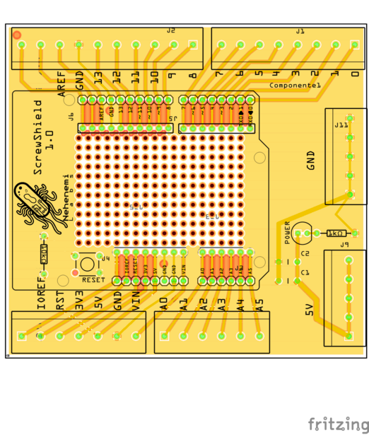

# ScrewShield for Arduino UNO 

  
Arduino Shield Compatible PCB with included proto soldering pad and extra 5V and GND terminals

## Electronics  
- C1, C2 100nf Ceramic Cap
- Power LED, 5 mm red LED
- 1x 10k&Omega;
- 1x 1k&Omega;

Made with [Fritzing](https://fritzing.org/) 
